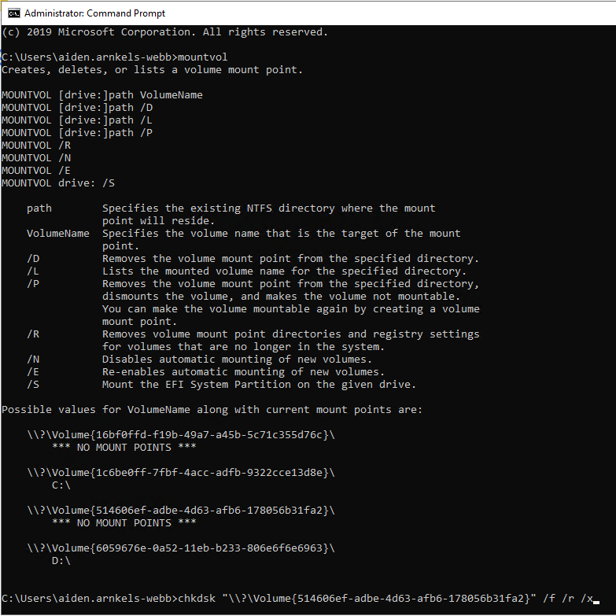
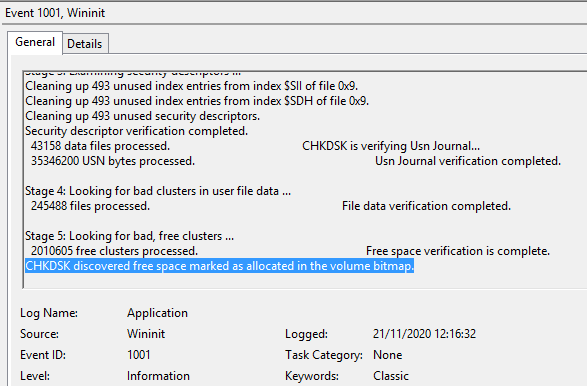

## The Problem

Veeam is failing to back up one of your Hyper-V VM's and is throwing the error: VHDx:CVhdxDisk.InitialValidation: Invalid bitmap block (all bitmap block of fixed and dynamic disks must be in SB\_BLOCK\_NOT_PRESENT state) Agent failed to process method {VHDx.GetDiskInformation}

## The Cause

The error is telling us that Veeam's VHDx InitialValidation function failed as the VHDx had blocks in an invalid state.

According to [Microsoft's OpenSpecs Documentation][1] for VHDx, the only valid Sector Bitmap Block state for fixed and dynamic disks is SB\_BLOCK\_NOT_PRESENT

Sector and Payload Bitmap blocks are used in the translation of VHD offset to a VHD file offset, and so is loosely analogous to traditional hard disk clusters.

We can therefore conclude that we are dealing with either VHDx corruption or file system cluster misallocation.

## The Fix

### Dealing with File System Corruption

Before we start, find the VM in Hyper-V Manager and delete/merge any checkpoints. Wait for the merge to complete before continuing.

If there are any checkpoints, the changes we make with chkdsk will only affect the differencing AVHDX file, and the VHDX file will remain corrupt.

1. Log in to the VM that is failing to be backed up

2. Run CMD as an Administrator and run `mountvol` to get a list of Volumes on the system, even those with no drive letter.

3. For each volume, run `chkdsk "\\?\Volume{VOLUMEID}" /f /r /x s` to dismount the disk to fix errors on the and repair bad sectors. If repairing the system volume, a reboot will be necessary and the scan will run on startup. It's vital that all volumes are scanned, not just those with a drive letter.

    

4. If chkdsk finds bad sectors, you will see this in the Chkdsk log under Stage 4 and 5.

    

5. Once chkdsk is complete on all drives, try running the backup again. If the SB\_BLOCK\_NOT_PRESENT error persists, try repairing the VHDx file as below

### Repair corrupt VHDx files

The only way to truly "repair" a VHDX file is to create a new one. To do this we're going to use Hyper-V Manager to convert the existing VHDx to a new one.

1. Find the affected VM in Hyper-V manager
2. Shut down the system and delete / merge any checkpoints it has. Wait for the merge to complete before continuing
3. Go into the VM settings and for each Virtual Hard Disk attacked go through the Edit Virtual Hard Disk Wizard
    1. Click Edit to open the wizard
    2. Under Choose Action, select Convert
    3. Choose VHDX as the disk format
    4. Choose your preferred Disk Type
    5. Choose a name and location for your new disk, keep a note of it. I recommend using the same path as the old disk and appending "_v2" before the extension
    6. Wait for disk conversion to complete
    7. Back in the VM settings, change the path to the new VHDX

4. Once all disks are converted and the new disks are attached to the VM. Boot it back up, ensure it's working and try running the backup again. It should now work

5. Once you're satisfied that your VM is running smoothly on its new VHDX's and is backing up successfully, archive or delete your old, corrupt VHDX files

 [1]: https://docs.microsoft.com/en-us/openspecs/windows_protocols/ms-vhdx/61251993-f2da-47af-b6ab-e8a8bd299094
